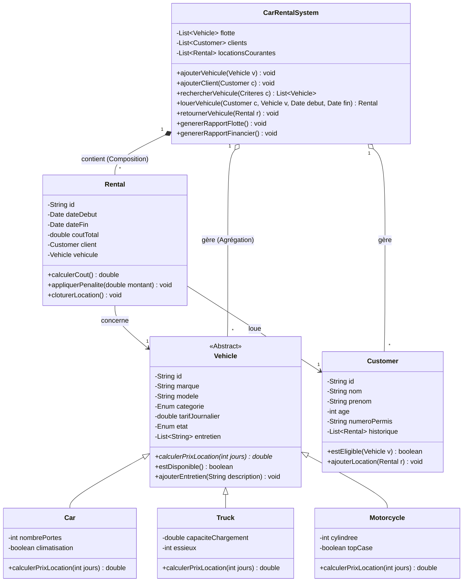

# Conception du projet

Voici le diagramme de classes de notre système :

```mermaid
classDiagram
    %% Hiérarchie des Véhicules
    class Vehicle {
        <<Abstract>>
        -String id
        -String marque
        -String modele
        -Enum categorie
        -double tarifJournalier
        -Enum etat
        -List~String~ entretien
        +calculerPrixLocation(int jours)* double
        +estDisponible() boolean
        +ajouterEntretien(String description) void
    }

    class Car {
        -int nombrePortes
        -boolean climatisation
        +calculerPrixLocation(int jours) double
    }

    class Truck {
        -double capaciteChargement
        -int essieux
        +calculerPrixLocation(int jours) double
    }

    class Motorcycle {
        -int cylindree
        -boolean topCase
        +calculerPrixLocation(int jours) double
    }

    %% Héritage
    Vehicle <|-- Car
    Vehicle <|-- Truck
    Vehicle <|-- Motorcycle

    %% Gestion des Clients
    class Customer {
        -String id
        -String nom
        -String prenom
        -int age
        -String numeroPermis
        -List~Rental~ historique
        +estEligible(Vehicle v) boolean
        +ajouterLocation(Rental r) void
    }

    %% Système de Réservation (Rental)
    class Rental {
        -String id
        -Date dateDebut
        -Date dateFin
        -double coutTotal
        -Customer client
        -Vehicle vehicule
        +calculerCout() double
        +appliquerPenalite(double montant) void
        +cloturerLocation() void
    }

    %% Relations de la classe Rental
    Rental --> "1" Customer : loue
    Rental --> "1" Vehicle : concerne

    %% Classe Centrale (Le Cerveau)
    class CarRentalSystem {
        -List~Vehicle~ flotte
        -List~Customer~ clients
        -List~Rental~ locationsCourantes
        +ajouterVehicule(Vehicle v) void
        +ajouterClient(Customer c) void
        +rechercherVehicule(Criteres c) List~Vehicle~
        +louerVehicule(Customer c, Vehicle v, Date debut, Date fin) Rental
        +retournerVehicule(Rental r) void
        +genererRapportFlotte() void
        +genererRapportFinancier() void
    }

    %% Relations du Système
    CarRentalSystem "1" o-- "*" Vehicle : gère (Agrégation)
    CarRentalSystem "1" o-- "*" Customer : gère
    CarRentalSystem "1" *-- "*" Rental : contient (Composition)
```
